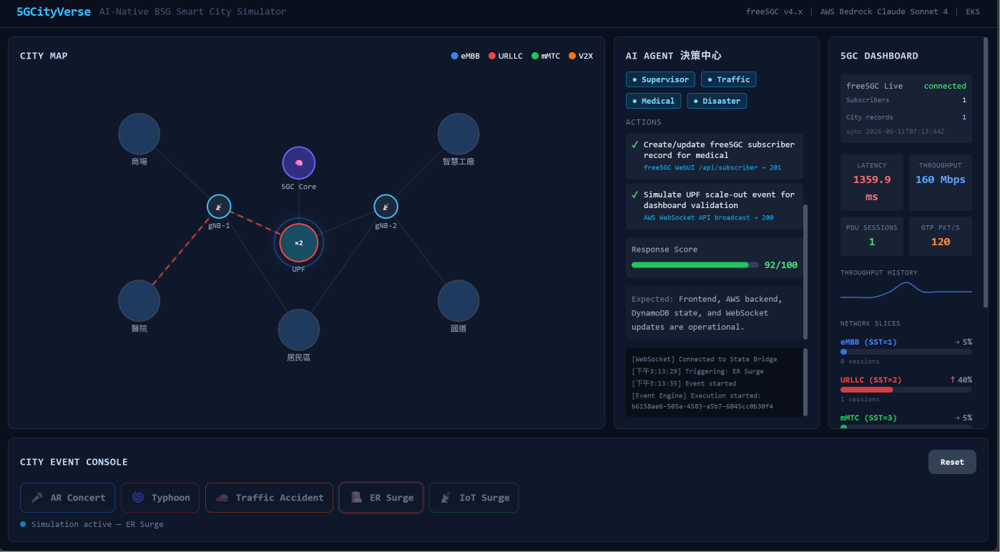

# 5GCityVerse

> An AI-Native B5G Smart City Simulator — Multi-Agent driven network resource orchestration built on free5GC, AWS Bedrock, and EKS.

Every animation on the city map reflects a real infrastructure event: a real K8s Pod scaling, a real free5GC NEF API call, a real HPA decision.

---

## What It Does

Users trigger city events (typhoon, AR concert, traffic accident, medical emergency). The system responds by:

1. **Bedrock Supervisor Agent** analyzes current network state via Prometheus / NWDAF
2. Sub-agents (Traffic / Medical / Disaster) call **free5GC NEF APIs** to reconfigure slices and QoS
3. **UERANSIM** generates real traffic → UPF CPU rises → **K8s HPA** scales pods
4. **Kinesis → WebSocket** pushes live state to the React dashboard




### Demo: ER Surge

When the **ER Surge** scenario is pressed, the city is simulating a sudden emergency-room load: ambulances, hospital telemetry, remote consultation, and patient-monitoring devices all need lower latency and more reliable connectivity than ordinary best-effort traffic. In 5GC terms, this is modeled as a medical service demand that should be mapped to the URLLC slice (`SST=2`) and protected from congestion caused by other city traffic.

The AI agent acts as the control-plane decision layer. It receives the ER Surge event, classifies it as a medical priority scenario, checks the current 5GC/application state, then decides which network intent should be applied: create or update the medical subscriber/profile, raise the URLLC slice pressure in the dashboard model, and trigger backend actions that represent UPF capacity preparation. The agent is not forwarding user packets itself; it is deciding what 5GC policy and orchestration action should be applied.

free5GC is the 5G core runtime that reflects those decisions. The backend writes subscriber, slice, QoS, flow rule, and charging-policy data into free5GC through the WebUI/API path. For real UE runtime, UERANSIM attaches to free5GC through AMF/SMF/UPF and establishes a PDU session; once the session exists, SMF allocates UE IP, installs PFCP session rules into UPF, and UPF handles the user-plane tunnel. In this demo, the right dashboard shows both configured records and live runtime state.

In the screenshot, the action log confirms two backend-side effects:

- `free5GC WebUI /api/subscriber -> 201`: the agent wrote the ER surge subscriber/policy data into free5GC.
- `AWS WebSocket API broadcast -> 200`: the backend pushed the new state to connected browsers.

The right **5GC Dashboard** is the runtime readout. `free5GC Live: connected` means the backend can reach the real free5GC WebUI API. `Subscribers` shows provisioned UE/subscriber records, while `City records` tracks scenario records created by the agent. `PDU Sessions` shows how many UEs are actually attached and carrying a data session through SMF/UPF. `GTP PKT/S`, latency, and throughput are the user-plane pressure indicators used by the demo to explain why UPF capacity may need to scale. For ER Surge, the URLLC slice (`SST=2`) is highlighted at higher load because the medical event is mapped to low-latency service behavior.

---

## Architecture

```
Browser (React + D3.js + SVG City Map)
        │ WebSocket / REST
        ▼
  AWS API Gateway
        │
   ┌────┴────────────────────────┐
   ▼                             ▼
Event Engine (Lambda)    Bedrock Orchestrator (Lambda)
   │ trigger UERANSIM           │ Tool Calls → Lambda → NEF API
   ▼                             ▼
          EKS Cluster
          ├── free5gc namespace
          │     AMF · SMF · UPF (HPA 1~4) · PCF · NSSF
          │     NEF  ◄── Bedrock Agent (VPC)
          │     NWDAF ──► Bedrock Agent (analytics)
          ├── ueransim namespace  (gNB + UE Jobs)
          └── monitoring namespace (Prometheus · Grafana)
```

---

## City Events

| Event | Slice | Key Behavior |
|---|---|---|
| AR Concert | eMBB (SST=1) | UERANSIM 50 UEs × iperf3 → UPF HPA 1→4 |
| Self-Driving Cars | URLLC (SST=2) | NEF Traffic Influence → Edge UPF priority |
| Smart Factory | Industrial URLLC | Isolated namespace, deterministic latency |
| Typhoon / Disaster | mMTC (SST=3) + URLLC | IoT Core → UERANSIM → AMF HPA scale |
| Traffic Accident | V2X (SST=4) | NEF PFD + Traffic Influence → rerouting |

---

## AI Agent Design

- **Supervisor Agent** — receives city event, queries network analytics, decides slice strategy
- **Traffic Agent** — calls `POST /3gpp-traffic-influence/v1/{afId}/subscriptions`
- **Medical Agent** — calls `POST /3gpp-as-session-with-qos/v1/{afId}/subscriptions`
- **Disaster Agent** — calls `POST /3gpp-pfd-management/v1/{afId}/transactions`
- **Official free5GC MCP** — exposes lifecycle, subscriber, and Kubernetes/Helm tools to MCP-capable agents

All tools are Lambda functions running inside the VPC, calling **free5GC NEF** directly via standard 3GPP TS 29.522 APIs — no fake endpoints.
For MCP-capable local agents, this repository points to the official free5GC MCP HTTP server at `http://127.0.0.1:8080`; see `docs/free5gc-official-mcp.md`.
To smoke-test the agent-side MCP path, run `python scripts/free5gc_mcp_probe.py --quiet-tools --call-tool subscriber_list`.

---

## Tech Stack

| Layer | Tools |
|---|---|
| Frontend | React · D3.js · SVG · TailwindCSS · WebSocket |
| AI | AWS Bedrock (Claude Sonnet 4) · Bedrock Agents · Lambda |
| Orchestration | Step Functions · EventBridge · Kinesis · DynamoDB |
| 5G Core | free5GC (AMF/SMF/UPF/PCF/NEF/NSSF/NWDAF) · UERANSIM · gtp5g |
| Infra | EKS · EC2 (custom AMI w/ gtp5g) · Terraform · Helm |
| Observability | Prometheus · Prometheus Adapter · Grafana · Timestream |

---

## Run Scripts

The scripts are written for Ubuntu/WSL. The default AWS profile is `kiki`; override it with `AWS_PROFILE=...` when needed.

```bash
cd /mnt/d/projects/5GCityVerse
chmod +x scripts/*.sh
```

If Terraform was first initialized from Windows and later used from WSL, refresh the provider lock file for Linux once:

```bash
cd /mnt/d/projects/5GCityVerse/infrastructure/terraform
terraform providers lock -platform=linux_amd64
terraform init
```

Full AWS deployment, including Terraform, EKS/free5GC/UERANSIM, frontend build, S3 sync, and CloudFront invalidation:

```bash
AWS_PROFILE=<YOUR_PROFILE> AWS_REGION=ap-northeast-1 ./scripts/deploy.sh
```

Start only the already-provisioned Kubernetes runtime after Terraform resources exist:

```bash
AWS_PROFILE=<YOUR_PROFILE> AWS_REGION=ap-northeast-1 ./scripts/start.sh
```

Run local frontend and local backend against the deployed free5GC runtime:

```bash
AWS_PROFILE=<YOUR_PROFILE> AWS_REGION=ap-northeast-1 ./scripts/local-dev.sh
```

Stop the Kubernetes runtime without deleting AWS infrastructure:

```bash
AWS_PROFILE=<YOUR_PROFILE> AWS_REGION=ap-northeast-1 ./scripts/stop.sh
```

Delete the runtime and Terraform-managed AWS resources:

```bash
AWS_PROFILE=<YOUR_PROFILE> AWS_REGION=ap-northeast-1 ./scripts/destroy.sh
```


## License

Apache 2.0

